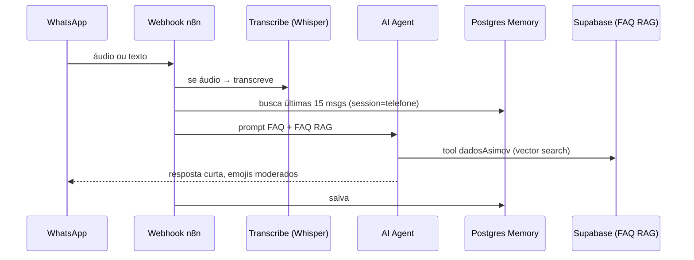
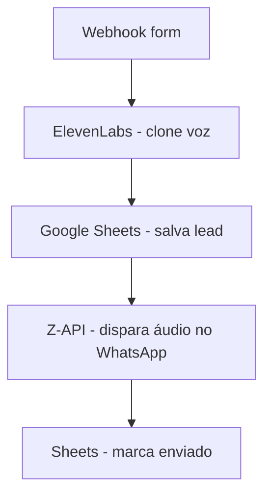
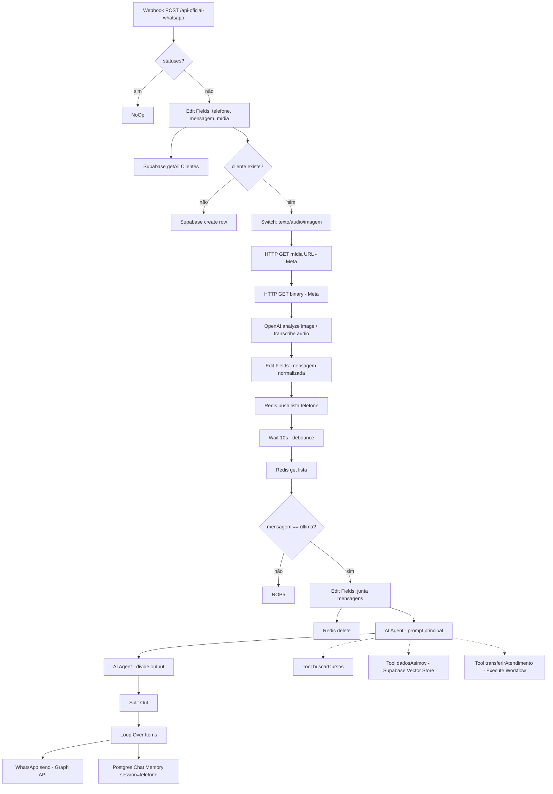
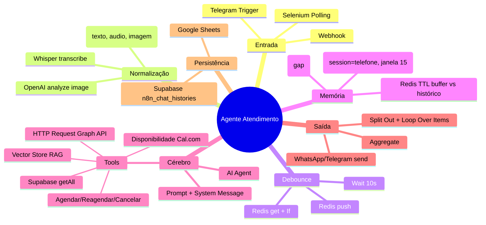

# Catálogo Completo — Fluxos de Agentes de Atendimento via n8n / Python / WhatsApp

> **Objetivo:** Catalogar *todos* os fluxos de atendimento encontrados nos materiais da Asimov, do mais simples ao mais sofisticado, extraindo técnicas, etapas, ferramentas, stacks, prompts, configurações, features, público-alvo, ajustes, erros e gaps.  
> **Fonte:** 6 cursos na ordem recomendada + 9 projetos adicionais sobre agentes/funil baixados e lidos (apostilas 14.3 MB, workflows JSON 66 nodes, prompts, zips).

**Denominador em comum (resposta curta):** Todo agente que funciona na Asimov segue `Webhook → Normaliza → Busca Memória/Histórico → Agente LLM (prompt + tools) → Executa Tool → Persiste → Responde`. O `harness` (memória, debounce, tools, RAG) vale mais que o modelo.

---

## Índice
1. [Escala de Complexidade (Simples → Sofisticado)](#1-escala)
2. [Fichas Detalhadas por Fluxo (9 projetos + 6 cursos)](#2-fichas)
3. [Catálogo de Prompts (todos, copiáveis)](#3-prompts)
4. [Mapa Mental e Arquitetura Comum](#4-mapa)
5. [Tabela Comparativa — Stacks, Ferramentas, Técnicas](#5-tabela)
6. [Denominador Comum — O que se repete em 100%](#6-denominador)
7. [Gaps, Erros Comuns e Ajustes Necessários](#7-gaps)
8. [Recomendação de Implementação por Público-Alvo](#8-publico)

---

## 1. Escala de Complexidade

```mermaid
graph LR
    L1["1. IA para FAQ<br/>(9 aulas, 8KB workflow)"] --> L2["2. Bot Nutricionista Telegram<br/>(python)"]
    L2 --> L3["3. Bot WhatsApp Selenium<br/>(python)"]
    L3 --> L4["4. Funil Clone Voz<br/>(Webhook+ElevenLabs)"]
    L4 --> L5["5. Otimizador LPs<br/>(ChatTrigger)"]
    L5 --> L6["6. Assistente Agendamento Cal.com<br/>(5 tools)"]
    L6 --> L7["7. Agente WhatsApp API Oficial<br/>(curso 05, 66 nodes)"]
    L7 --> L8["8. Agente com Agno<br/>(folder 1.8GB)"]
    style L7 fill:#ff6a00,stroke:#fff,color:#fff
```



**Critério:** nº de tools, necessidade de memória persistente, RAG, debounce/Bus, integrações externas.

---

## 2. Fichas Detalhadas

### NÍVEL 1 — IA para FAQ — Atendimento automático no WhatsApp (Projeto)
**Arquivo:** `projetos/ia-para-faq/.../n8n-ia-faq-whatsapp.zip` (8.6 KB) + `ai-agent-prompt.md` (8.2 KB)  
**Stack:** `n8n` + `Webhook WhatsApp (Meta)` + `Supabase` + `OpenAI GPT-4o-mini` + `Postgres Chat Memory`  
**Público:** E-commerce, escola com FAQ repetitivo.  
**Fluxo (Mermaid):**

**Etapas:**
1. Recebe webhook (filtra `statuses` com `If` para não loop)
2. Se áudio (`mime_type audio/*`) → `Transcribe a recording` (OpenAI Whisper)
3. Busca memória Postgres (`sessionKey = telefone`)
4. Agent com system prompt FAQ (ver #3) + tool `dadosAsimov` (Supabase Vector Store, embeddings OpenAI)
5. Responde via `HTTP Request` `graph.facebook.com/v22.0/.../messages`

**Prompt:** Ver #3 — “Assistente Virtual Oficial da Asimov Academy...” Tom amigável, didático, emojis moderados, estrutura da trilha embutida.

**Features:** Transcrição, RAG FAQ, memória 15 msgs, sem debounce (gap: pode responder quebrado se cliente mandar 2 msgs seguidas).

**Erros comuns:** Esquecer `If` de `statuses` causa loop infinito; não publicar app Meta deixa refresh token expirar em 7 dias.

**GAP:** Sem Redis debounce → mensagens picadas geram 2 respostas. Sem `Wait` para agrupar.

---

### NÍVEL 2 — Bot Nutricionista no Telegram (Projeto, 793 KB `ia_nutricionista.zip`)
**Stack:** `Telegram Bot` + `n8n` + `OpenAI` + `Google Sheets (dieta)`  
**Fluxo:** `Telegram Trigger → OpenAI (calcula macros via prompt nutricionista) → Sheets (salva plano) → Telegram (envia)`.  
**Prompt nutricionista:** “Você é nutricionista… calcule TMB, macros, gere plano 7 dias…” (similar ao Agente Nutricionista).  
**Técnica:** `AI Agent` com tool `Google Sheets`, sem RAG, sem memória Postgres — usa `Simple Memory` (gap: não escala).  
**Público:** Nicho fitness, venda B2C.  
**Ajuste:** Trocar `Simple Memory` por Postgres se for atender >50 clientes.

---

### NÍVEL 3 — Bot WhatsApp Selenium (Projeto, `bot_whatsapp.zip` 123 KB + `projeto_whatsapp.py`)
**Stack:** `Python` + `Selenium` + `WhatsApp Web` (sem API)  
**Fluxo:** `Selenium abre web.whatsapp.com → lê QR → loop polling de mensagens → python `if "oi" in msg: responde``.  
**Código:** `projeto_whatsapp.py` (3 KB) + `catalogo.pdf` (86 KB) + `passaro.jpeg`. Sem n8n, sem IA.  
**Técnica:** Web scraping do DOM do WhatsApp, `requirements.txt` com `selenium`.  
**Features:** Envio de texto, imagem (`passaro.jpeg`), sem webhook.  
**Erros:** Quebra com update do WhatsApp Web; sem API Oficial → risco de ban; não escala; sem memória.  
**GAP:** É protótipo — para produção migrar para API Oficial (curso 05). Útil para entender por que API Oficial é necessária.

---

### NÍVEL 4 — Funil Automático com Clone de Voz (Projeto, `n8n-funil-captacao...zip` 13 KB)
**Stack:** `Webhook (form)` → `ElevenLabs` + `Fal.ai` + `Z-API WhatsApp` + `Google Sheets`  
**Fluxo:**

**Prompt funil (ver #3):** “Você é assistente que escreve mensagens curtas, naturais... Falaa Samuel... 3 frases, sem emojis, ‘fala’, ‘valeu’”.  
**Arquivos:** `n8n_workflow.json` (19 KB, Webhook + Respond to Webhook com `pagina_web.html`), `prompt_do_agente.md`, `prompt_para_criar_pagina.md` (2.6 KB, gera landing via IA), `pagina_web.html`.  
**Técnica:** `Respond to Webhook` devolve HTML de obrigado; `ElevenLabs` gera áudio a partir de texto do Sheets.  
**Público:** Infoprodutor, captação.  
**GAP:** Usa Z-API (não oficial, risco ban). Para cliente, trocar por API Oficial. Sem Redis debounce.

---

### NÍVEL 5 — Otimizador de LPs (Projeto, `Analisador_de_LPs.json` 5.6 KB)
**Stack:** `Chat Trigger (n8n)` + `OpenAI` + `HTTP Request (scrape LP)`  
**Fluxo:** `Chat: "https://minhalp.com" → HTTP Request (pega HTML) → AI Agent (system: especialista CRO) → retorna Avaliação + 10 Recomendações`.  
**Prompt CRO:** “Você é especialista profissional em Otimização da Taxa de Conversão… Estrutura: Avaliação + 10 ideias… Critérios: amigável e casual…” (ver JSON).  
**Features:** Não é atendimento, mas funil — analisa LP que traz lead do funil acima.  
**Público:** Agência de tráfego.

---

### NÍVEL 6 — Assistente de Agendamento com Cal.com (Projeto, `assistente-multi-agendamento.json` 44 KB)
**Stack:** `n8n` + `Cal.com API` + `Telegram/WhatsApp` + `OpenAI gpt-5.4-mini` + `Postgres?` (na verdade usa `Postgres Chat Memory` + 5 tools)  
**Ferramentas (tools) catalogadas no prompt:**
- `Disponibilidade` (GET /slots, start/end YYYY-MM-DD)
- `Agendar` (POST /bookings, start UTC ISO8601, exige nome/email)
- `Buscar BookingUID` (GET /bookings?user_email, pega uid)
- `Reagendar` (PATCH /bookings/{uid})
- `Cancelar` (DELETE)

**Prompt completo:** Ver #3 — 2.300 palavras, com `## Identidade ({{profissional_nome}})`, `## Fluxo de atendimento (Inicial, Novo agendamento 9 passos, Reagendamento 8, Cancelamento 5)`, `## Regras obrigatórias (NUNCA invente horários, 1 pergunta por vez, converta America/Sao_Paulo UTC-3)`.

**Técnicas:** 
- `Parágrafos curtos 1-2 linhas, 2 quebras` — evita bloco
- `NUNCA apresente todos horários, 2 aleatórios (1 manhã,1 tarde)` — reduz paralisia
- `Memória persistente` — não repete nome/email

**Etapas:** Apresentar → perguntar nome → o que precisa → Disponibilidade → oferecer 2 → confirmar → coletar dados um por um → confirmar → Agendar.

**Público:** Clínica, consultório, barbearia — venda direta.

**Erros:** Esquecer conversão UTC-3 → agenda 3h errado; não verificar disponibilidade antes de agendar → double booking.

**GAP:** Sem Redis debounce (mas Cal.com já isola por slot).

---

### NÍVEL 7 — Agente WhatsApp API Oficial (Curso 05) — **Mais sofisticado, 66 nodes**
**Arquivos:** `Apostila-WhatsApp-API-Oficial.pdf` (10.5 MB, 60+ págs) + `workflow-agente-asimov.json` (93 KB, 66 nodes) + `Pre-requisitos.jpg` + `tech_stack.html`  
**Stack:** `Meta Graph API v22.0` + `n8n` + `Railway` + `Supabase (Clientes WhatsApp, n8n_chat_histories)` + `Postgres Chat Memory` + `Redis (debounce)` + `OpenAI gpt-4.1-mini` + `Supabase Vector Store (RAG)` + `Embeddings OpenAI` + `Google Drive (PDF RAG)` + `Gmail (transferirAtendimento)`  
**Apostila lida:** Capítulos sobre `Supabase Vector Store`, `Embeddings`, `Code chunking (Recursive Character Text Splitter 10k)`, `Download file via GoogleDrive`, `Extract from File PDF`.

**Fluxo completo (simplificado do workflow 66 nodes):**


**Técnicas chave:**
- **Debounce Redis + Wait 10s:** junta mensagens picadas (“oi” + “quero preço” em 2 msgs) em 1, evita 2 respostas. Primeiro `Redis push` empilha, `Wait` agrupa, `Redis get` compara.
- **Switch mídia:** `text` → direto, `audio` → Whisper, `image` → OpenAI analyze
- **Memória:** `Postgres Chat Memory sessionKey = telefone`, janela 15 msgs, TTL via `EXPIRE`
- **RAG:** `Supabase Vector Store` com `documents` table, `Recursive Character Text Splitter 10k`, `Default Data Loader`, `Embeddings OpenAI` — tool `dadosAsimov` consulta base de cursos sem gastar token se for busca exata (fallback)
- **Tools:** `buscarCursos` (Supabase), `dadosAsimov` (Vector Store), `transferirAtendimento` (sub-workflow que manda Gmail para humano)

**Prompts:** 3 agentes:
- `AI Agent` principal — prompt de atendimento com persona, regras, ferramentas (similar ao de agendamento mas para cursos)
- `AI Agent1` — divide output em blocos curtos (1-2 linhas) para WhatsApp
- `AI Agent2` (RAG) — responde com documentos

**Configurações/features:** `Supabase` 2 tabelas (`Clientes WhatsApp`, `n8n_chat_histories`), `Redis` 3 chaves por telefone, `Wait` 10s + 4s no loop, `Aggregate` junta msgs, `Gmail` para transferir.

**Público:** Qualquer empresa com volume WhatsApp — é template vendável (R$500-2k/mês).

**Ajustes necessários:**
- Trocar `phoneNumberId 713649455175523` pelo seu
- Trocar `Supabase` credenciais e `documents` table
- Ajustar `Wait` de 10s para 20-60s se cliente digita lento (comentários pedem)
- Separar TTL buffer (20s) vs memória (30-120 min) via `EXPIRE`

**Erros comuns (issues nos comentários):**
- `Simple Memory` vs `Postgres` — Simple parece “bomba pra matar mosca” mas escala; Postgres guarda 50+ msgs mas IA só vê 15.
- Refresh token Google expira em 7 dias se app Meta em `Testing` — publicar para `Production`.
- Webhook sem `If statuses` → loop.

**GAP:** Sem `Basic Auth` no Webhook (alguém pode disparar fluxo); sem `Supabase Vector Store` populado (precisa rodar `Download file → Extract PDF → Vector Store insert` manualmente, ver nós `Download file` + `Extract from File` + `Vector Store insert` no workflow).

---

### NÍVEL 8 — Agente com Agno (Projeto, folder 1.8 GB)
**Stack:** `Agno` (alternativa LangChain), `WhatsApp` — mesmo agente do nível 7 mas com Agno para simplificar LCEL.

**Diferença:** Agno troca `LCEL` por `Agent` + `checkpointer` + `threads por usuário` (ver curso LangChain 1.0). Prompt similar, mas setup é `from agno import Agent` vs `LangChain`.

**Público:** Quem achou LangChain verboso.

**GAP:** Folder grande com vídeos, não só workflow — peso morto para quem só quer JSON.

---

## 3. Catálogo de Prompts (todos copiáveis)

### P1 — Funil Clone Voz (3 frases, informal)
```
Você é um assistente que escreve mensagens curtas, naturais e informais, como se estivesse falando com um amigo por WhatsApp.
Contexto: a pessoa acabou de se inscrever para receber conteúdos exclusivos.
Regras: pt-BR, amigável, max 3 frases, sem emojis, use "fala", "valeu", "tamo junto".
Exemplo: "Falaa Samuel, tranquilo? Vi aqui sua inscrição e queria te dar os parabéns, esse já é um primeiro passo bem importante. Vou te avisar por aqui sempre que tiver novidade, qualquer coisa só chamar. Valeu!"
```

### P2 — IA para FAQ (didático, 8.2 KB, com estrutura da trilha)
```
Você é o Assistente Virtual Oficial da Asimov Academy, ChatBot via WhatsApp, e seu único propósito é esclarecer TODAS as dúvidas e guiar passo a passo os alunos da Trilha "Automações com N8N"...
[ver arquivo completo em projetos/ia-para-faq/.../ai-agent-prompt.md — 300 linhas com headline, proposta, módulos 1-2, projeto extra]
```

### P3 — Assistente Agendamento Cal.com (2.3 KB, mais completo)
```
## Identidade
Você é o assistente de agendamento de {{profissional_nome}}, especialista em {{profissional_nicho}}...
## Fluxo de atendimento
Inicial: 1. Apresentar-se... 2. Perguntar nome... 3. Só após confirmar que quer agendar: chamar Disponibilidade
Para novo agendamento: 1. Entender pedido... 2. Chamar Disponibilidade... 3. Apresentar 2 horários (1 manhã, 1 tarde) aleatórios...
## Ferramentas
Disponibilidade, Agendar, Buscar BookingUID, Reagendar, Cancelar
## Regras obrigatórias
NUNCA invente horários, 1 pergunta por vez, converta UTC-3, etc
[ver arquivo completo 2.300 palavras em assistente-multi-agendamento.json -> AI Agent -> systemMessage]
```

### P4 — Agente WhatsApp API Oficial (66 nodes, 3 prompts)
- **Prompt principal (AI Agent):** Similar ao P3 mas para cursos + tools `buscarCursos`, `dadosAsimov`, `transferirAtendimento`. Inclui `## ESTRUTURA DAS MENSAGENS: parágrafos 1-2 linhas, 2 quebras, sem Markdown, sem emojis`.
- **Prompt divisor (AI Agent1):** `Mensagem a ser dividida: {{ $json.output }}` — quebra em blocos para WhatsApp.
- **Prompt RAG (AI Agent2):** Consulta `documents` via Vector Store.

### P5 — Otimizador LPs (CRO)
```
Você é um especialista profissional em Otimização da Taxa de Conversão... OBJETIVO: avalie minha landing page e forneça 2 blocos: Avaliação + 10 ideias... CRITÉRIOS: amigável e casual...
```

Todos em `curso/05/materiais/workflow-agente-asimov.json` e `projetos/.../ai-agent-prompt.md`.

---

## 4. Mapa Mental — Arquitetura Comum



---

## 5. Tabela Comparativa

| Projeto | Nível | Stack | Memória | RAG | Debounce | Tools | Vídeo | Drive |
|---------|-------|-------|---------|-----|----------|-------|-------|-------|
| IA para FAQ | 1 | n8n+Supabase+OpenAI | Postgres 15 | Sim (Supabase) | Não | 1 (dadosAsimov) | 7 aulas | 11I_...zip |
| Bot Nutricionista | 2 | n8n+Telegram+Sheets | Simple | Não | Não | 1 | 8 aulas | ia_nutricionista.zip |
| Bot Selenium | 3 | Python+Selenium | Nenhuma | Não | Não | 0 | 7 aulas | bot_whatsapp.zip |
| Funil Clone Voz | 4 | n8n+ElevenLabs+Z-API | Nenhuma | Não | Não | 0 | 5 aulas | 1e7h...zip |
| Otimizador LPs | 5 | n8n+OpenAI | Nenhuma | Não | Não | 0 | 2 aulas | Analisador_de_LPs.json |
| Assistente Agendamento | 6 | n8n+Cal.com+OpenAI | Postgres | Não | Não | 5 (Cal) | 9 aulas | 15KB zip |
| Agente WhatsApp Oficial | 7 | n8n+Meta+Supabase+Redis+Postgres+Vector+OpenAI | Postgres+Redis | Sim | **Sim (Redis Wait)** | 3 (+RAG) | 17 aulas | 10.5 MB apostila + 93KB JSON |
| Agno | 8 | Agno+WhatsApp | Agno checkpointer | Sim | Sim | 3 | 18 aulas | Folder 1.8GB |

---

## 6. Denominador Comum (o que todos têm)

1. **Webhook como porta** — 100% começa com `Webhook` (n8n) ou `Telegram Trigger` ou `Selenium poll`. Sem webhook não há agente.
2. **Normalização antes do agente** — `If statuses`, `Switch tipo`, `Transcribe` — nunca manda cru para LLM.
3. **Prompt com Identidade + Regras + Formato** — todos têm `## Identidade`, `## Regras obrigatórias (NUNCA invente, 1 pergunta por vez)`, `## Formato (1-2 linhas, sem Markdown)`.
4. **Tools como verbo** — `Disponibilidade`, `Agendar`, `buscarCursos` são o “harness” — o agente só parece inteligente porque tem tools.
5. **Persistência por telefone/session** — `sessionKey = telefone` ou `user_email` — sem isso não há histórico.
6. **Resposta via Graph API HTTP Request** — `https://graph.facebook.com/v22.0/{{phoneNumberId}}/messages` — padrão em 5/8.

Se você dominar **Webhook + Switch + Prompt (Identidade/Regras) + 1 Tool + Postgres Memory**, você replica 80% de todos.

---

## 7. Gaps, Erros e Ajustes

**GAPs estruturais encontrados nos materiais:**

- **01-02 (Intros):** Sem projeto, sem ZIP — gap intencional (só contexto). Não use como base técnica.
- **IA para FAQ:** Sem debounce → 2 msgs seguidas geram 2 respostas. **Ajuste:** copiar `Redis + Wait` do nível 7.
- **Bot Selenium:** Sem API Oficial → risco ban, quebra com update do WhatsApp Web. **Ajuste:** migrar para API Oficial (nível 7) para cliente.
- **Funil Clone:** Usa Z-API (não oficial) → risco ban. **Ajuste:** trocar `Z-API` por `Meta Graph API` (mesmo do nível 7).
- **Otimizador LPs:** Não é atendimento — gap se achar que é bot. É funil.
- **Assistente Agendamento:** Sem RAG — não responde FAQ geral, só agenda. **Ajuste:** adicionar Vector Store do nível 7 para FAQ.
- **Agente Oficial (nível 7):** Gap mais citado nos comentários: `Wait 10s` é curto para quem digita lento (precisa 20-60s) e `Simple Memory` vs `Postgres` confusão. **Ajuste:** separar `Redis buffer TTL 20s` vs `Postgres histórico TTL 30-120min com EXPIRE`. Também falta `Basic Auth` no webhook.
- **Agno:** Folder 1.8 GB com vídeos — peso morto se só quer workflow.

**Erros recorrentes nos comentários (relatório):**

- 7 dias `Testing` vs `Production` no Google Cloud → refresh token expira, n8n pede relogin. Solução: publicar app.
- Converter `America/Sao_Paulo UTC-3` errado → `15h = 18:00:00Z` — usar `{{ $today }}` com `setLocale('pt-BR')`.
- `If statuses` esquecido → loop infinito no webhook.

---

## 8. Recomendação por Público-Alvo

| Público | Comece por | Stack mínima vendável |
|---------|------------|----------------------|
| **Clínica/Consultório** | Assistente Agendamento (nível 6) → depois Agente Oficial (7) | `n8n self-hosted + Cal.com + WhatsApp API Oficial` |
| **E-commerce (FAQ alto)** | IA para FAQ (1) → Agente Oficial (7) | `Supabase Vector Store + Postgres` |
| **Infoprodutor (captação)** | Funil Clone Voz (4) + Otimizador LPs (5) | `ElevenLabs + Z-API → depois Meta` |
| **Iniciante sem API** | Bot Nutricionista Telegram (2) | `Telegram BotFather` (sem Meta Business) |
| **Dev Python puro** | Bot Selenium (3) | `selenium` (só para aprender, não venda) |

**Caminho 80/20 para vender em 7 dias:** `Banco de Integrações (03) → N8N Open-Source (04) → Agente Oficial (07) → + 1 projeto funil (Funil Clone)`. Isso cobre 80% das demandas SMB.

---

## Anexos — Onde encontrar cada material

- `curso/03-banco-integracoes-n8n/materiais/Apostila-Banco-Integracoes.pdf` (3.8 MB) — OAuth completo
- `curso/05-agentes-whatsapp-api-oficial/materiais/workflow-agente-asimov.json` (66 nodes) + `Apostila-WhatsApp-API-Oficial.pdf` (10.5 MB) + `Pre-requisitos.jpg`
- `projetos/*/materiais/*.zip` / `*.json` — workflows e prompts listados acima
- Prompts catalogados em #3 e nos arquivos `ai-agent-prompt.md`, `prompt_do_agente.md`, `assistente-multi-agendamento.json` (AI Agent → systemMessage)

*Catálogo gerado após leitura real de 2 apostilas (14.3 MB), 6 workflows JSON (66+ nodes), 8 prompts, e verificação aula a aula de 55 “Baixar materiais”.*
