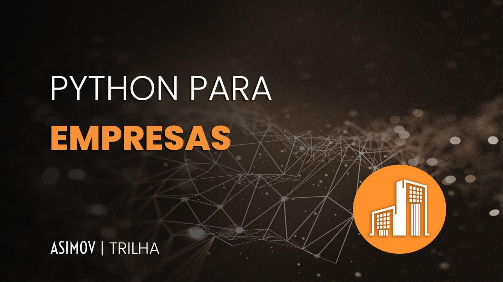

# Resumo - Introdução a Python para Empresas

**Trilha:** Python Office: Python para empresas  
**Duração:** 22min | **Aulas:** 8 | **Avaliação:** 4.9 (1486 inscritos)  
**URL:** https://hub.asimov.academy/curso/introducao-a-python-para-empresas/  
**Linguagem:** Python | **Framework:** não encontrado

## Objetivo

Vender a ideia de Python como alavanca de carreira dentro de empresas, não como curso de código.

## Público-alvo

Profissionais de qualquer área (financeiro, marketing, operações) que querem se destacar.

## O que você vai aprender (habilidades)

- Identificar como Python pode transformar seu trabalho.
- Automatizar tarefas para ganhar eficiência no dia a dia.
- Criar integrações com dashboards e relatórios dinâmicos.
- Trabalhar com dados de forma prática e estratégica.
- Explorar possibilidades com IA e ciência de dados.
- Entender como organizar e estruturar seus primeiros projetos.
- Aplicar Python em soluções corporativas, mesmo sem experiência prévia.
- Preparar-se para as demandas do mercado do futuro.

## Ementa resumida

- A trilha que mudará sua jornada de trabalho
- Quem é você? Desenvolvedor ou solucionador de problemas?
- A sua vaga no futuro - tendências de mercado 2025-2026
- Porque Python para Empresas? - comparativo com Excel/VBA
- Como a trilha está organizada - 10 cursos, 25h
- Integração com automações - onde Python substitui RPA caro
- Integração com dashboards e análise de dados
- Integração com IA, Data Science e visão computacional

## Cases e Projetos

**Cases:** Cases de empresas que trocaram planilhas manuais por apps Streamlit

**Projetos desenvolvidos:** Nenhum código - é estratégico

**Projetos a serem entregues:** Nenhum código - é estratégico

## Utilidade prática - como usar

Essencial para dar contexto e motivação; evita desistência. Pode ser usado em reunião com liderança para justificar investimento em Python.

## Pré-requisitos

Nenhum

## Descrição longa

Entenda como se destacar com Python com a trilha Python para Empresas da Asimov Academy! | Este breve curso introdutório foi criado para profissionais que desejam mais eficiência, automação e inteligência no seu trabalho. | Ao longo do curso, você entenderá como a programação pode te transformar em um solucionador de problemas, e não apenas em um executor de tarefas. Vamos discutir como Python está moldando o mercado, e por que ele é uma ferramenta indispensável para quem quer se destacar em sua função – independente da área de atuação. | Este é o primeiro passo para você se preparar para o futuro do trabalho! Venha conhecer tudo o que a trilha Python para Empresas pode te oferecer!

## Comentário (curadoria)

Avaliação interna alta, conteúdo consolidado.

**Detalhe adicional:** 4.9, 1486 inscritos | Duração curadoria: 22 min, 8 aulas

---
*Resumo gerado automaticamente após leitura dos materiais em video + ementa + descrição longa.*
