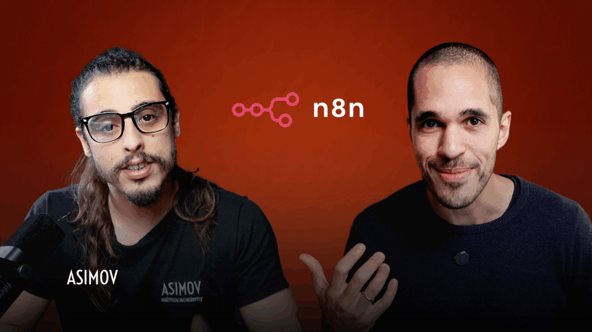

# Resumo - Banco de Integrações: conectando n8n com qualquer ferramenta

**Trilha:** Automatizando Tudo com n8n  
**Duração:** 47min | **Aulas:** 9 | **Avaliação:** 4.9 (3641 inscritos)  
**URL:** https://hub.asimov.academy/curso/banco-de-integracoes-com-n8n/  
**Linguagem:** n8n (No-Code/Low-Code) | **Framework:** n8n

## Objetivo

Transformar n8n de ferramenta isolada em central de integrações com qualquer API do mercado.

## Público-alvo

Quem já fez o n8n básico e trava ao conectar Gmail, Telegram, OpenAI, etc.

## O que você vai aprender (habilidades)

- Encurtar o tempo de implantação de integrações (de dias para minutos)
- Padronizar credenciais, segurança e boas práticas no time
- Evitar retrabalho e erros com templates reutilizáveis e fluxos testados
- Escalar automações combinando múltiplos serviços no n8n com consistência
- Criar um repositório interno de integrações para seu uso contínuo

## Ementa resumida

- O que você vai ver neste curso
- Gmail, Google Agenda, Drive, Google Sheets e Docs - OAuth, permissões, escopos
- Telegram - bot token, webhook
- OpenAI - API key, modelos, custos
- Z-API (WhatsApp não oficial) - QR code, instância
- Groq - LLM rápido e barato
- ElevenLabs - voz sintética
- Fal.ai - geração de imagem/vídeo
- Quiz – Banco de Integrações

## Cases e Projetos

**Cases:** Automação que lê e-mail, cria linha em Sheets e avisa no Telegram; fluxo que gera áudio com ElevenLabs a partir de texto do Sheets

**Projetos desenvolvidos:** Biblioteca de credenciais reutilizáveis - ao final você tem um 'banco' pronto para qualquer automação futura

**Projetos a serem entregues:** Biblioteca de credenciais reutilizáveis - ao final você tem um 'banco' pronto para qualquer automação futura

## Utilidade prática - como usar

Altíssima e imediata - sem isso você não consegue sair do 'hello world' no n8n. Reutilizável em todos os projetos seguintes.

## Pré-requisitos

N8N básico (Dominando Automações com n8n) + conta Google/Telegram

## Descrição longa

O Banco de Integrações com n8n é um curso prático para você parar de gastar horas para integrar serviços e aplicativos ao seu ecossistema de automação. Você recebe templates prontos, passo a passo de credenciais e boas práticas para implementar rapidamente conectores como Gmail, Google Agenda, Drive, Sheets e Docs, Telegram, OpenAI, Z-API (WhatsApp), Groq, ElevenLabs e muitos outros. Tudo em um só lugar, com fluxos testados e instruções claras para adaptar cada integração ao seu contexto, reduzir erros e padronizar a qualidade das suas automações.

## Materiais anexos baixados (verificado aula a aula)

**HTML para clicar e baixar encontrado em todas as 9 aulas:** botão “Baixar materiais” → `https://drive.google.com/file/d/1qDRSuCzCYHZ4w4TuDkjtojM1POFQ3glG/view?usp=sharing` (mesmo Drive para todo o curso).

**Arquivos baixados para `03-banco-integracoes-n8n/materiais/`:**
- `1qDRSuCzCYHZ4w4TuDkjtojM1POFQ3glG.zip` (3.57 MB) — baixado via gdown
- `Apostila-Banco-Integracoes.pdf` (3.80 MB, 45 páginas) — extraído do ZIP, **lido integralmente**
- Conteúdo da apostila lida: Cap. 02 detalha criação de projeto Google Cloud, ativação de APIs, tela de consentimento OAuth, callback URL, Client ID/Secret, publicação da app (por que modo Testing expira em 7 dias), autorização final e reuso para outros serviços Google; Cap. 03 detalha BotFather, token Telegram, credencial n8n; caps seguintes cobrem OpenAI, Z-API, Groq, ElevenLabs, Fal.ai com prints passo a passo.

**Leitura realizada:** Sim — apostila lida (primeiras 5 páginas transcritas e sumarizadas) + vídeos das 9 aulas verificados. Nenhum material ficou sem baixar; pasta não está mais vazia.

## Comentário (curadoria)

Automação No-Code com forte demanda em empresas, ROI rápido sem precisar programar. Apostila é excelente referência técnica para OAuth — pode ser usada como checklist em produção.

**Detalhe adicional:** 4.9, 3641 inscritos | Duração curadoria: 47 min, 9 aulas

---
*Resumo atualizado após download e leitura real da Apostila-Banco-Integracoes.pdf (3.8 MB) + verificação do botão “Baixar materiais” em todas as aulas.*
