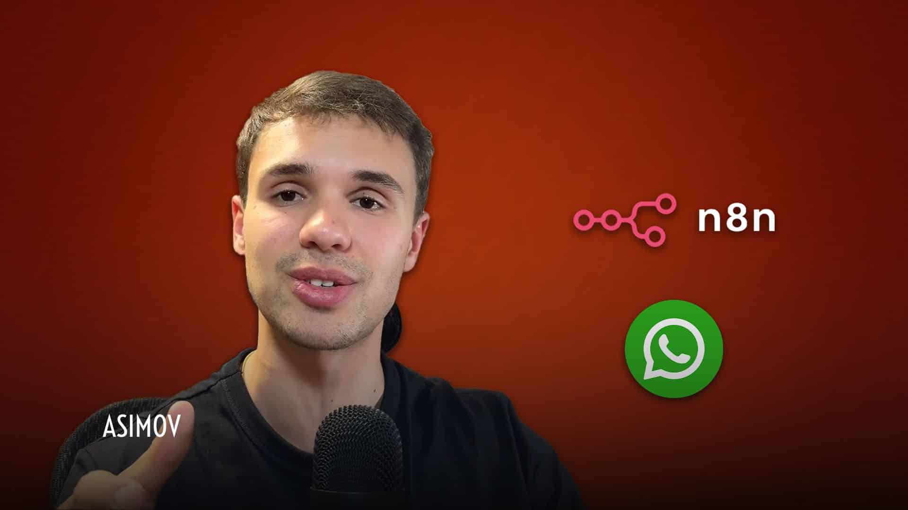

# Resumo - Criando agentes de atendimento profissionais no Whatsapp

**Trilha:** Automatizando Tudo com n8n  
**Duração:** 2h 29min | **Aulas:** 17 | **Avaliação:** 4.8 (3714 inscritos)  
**URL:** https://hub.asimov.academy/curso/domine-a-api-oficial-do-whatsapp-com-n8n/  
**Linguagem:** n8n (No-Code/Low-Code) | **Framework:** n8n

## Objetivo

Ensinar a criar agentes de atendimento que respondem no WhatsApp via API Oficial da Meta, integrados ao n8n e IA.

## Público-alvo

Quem quer vender atendimento automatizado para empresas (clínicas, e-commerce, etc).

## O que você vai aprender (habilidades)

- Configurar o ambiente: preparar n8n e a infraestrutura (ex.: Railway) para rodar seus fluxos.
- Criar o app na Meta: obter credenciais, ativar webhooks e cumprir os pré-requisitos da API Oficial do WhatsApp.
- Conectar o número ao n8n: validar envio/recebimento de mensagens e integrar com bancos de dados (contatos, logs, métricas).
- Montar o Agente no n8n: desenhar o fluxo, escrever prompts, adicionar tools (CRUD, templates, buscas) e usar RAG quando preciso
- Colocar em produção com segurança: monitorar, depurar, escalar e aplicar boas práticas de custos e manutenção contínua.

## Ementa resumida

- Introdução à Trilha e Tech Stack - o que vamos construir
- Instalação da Infraestrutura na Railway - Postgres, n8n
- Pré-requisitos da API Oficial do WhatsApp - Meta Business, verificação
- Criando o Aplicativo na Meta - app_id, token, permissões
- Configurando e Registrando Número Virtual na Meta
- Ativando Webhook da Meta no n8n - validação, token verify
- Conectando Número com API Oficial no n8n - teste de envio
- Quiz – Configurando a API Oficial
- Criando e Conectando Bancos de Dados e OpenAI no n8n - Postgres + memória
- Criando Fluxo e Estrutura do Prompt do Agente
- Escrevendo Prompt do Agente de IA - persona, regras, tom
- Criando Ferramentas do Agente - consultar agenda, banco, etc
- Estrutura e Criação da Tabela n8n_chat_histories - histórico por usuário
- Teste de conversa multi-turno
- Tratamento de erros e fallback humano
- Deploy e monitoramento
- Próximos passos e como cobrar

## Cases e Projetos

**Cases:** Agente de clínica que agenda consulta via WhatsApp; e-commerce que consulta estoque e rastreio; suporte que abre ticket

**Projetos desenvolvidos:** Um agente completo em produção respondendo no WhatsApp real, com histórico e ferramentas

**Projetos a serem entregues:** Um agente completo em produção respondendo no WhatsApp real, com histórico e ferramentas

## Utilidade prática - como usar

Altíssima e monetizável - é o projeto mais vendável da trilha n8n. API Oficial = sem risco de ban vs Z-API.

## Pré-requisitos

Banco de Integrações + N8N Open-Source + conta Meta Business verificada + OpenAI API

## Descrição longa

Dominando a API Oficial do WhatsApp com n8n é um curso prático e direto para você dominar a automação de fluxos de comunicação usando a API oficial do WhatsApp integrada ao n8n. | Este curso oferece templates prontos, instruções passo a passo para configuração de credenciais e boas práticas para criar automações robustas e personalizadas. | Com fluxos testados e guias claros, você poderá implementar automações que otimizam o atendimento ao cliente, enviam mensagens automáticas, gerenciam contatos e integram dados em tempo real, tudo adaptável às suas necessidades específicas.

## Materiais anexos baixados (verificado aula a aula)

**HTML para clicar e baixar encontrado em 2+ aulas (ex: aula 10 “Criando e Conectando Bancos...” e 11 “Criando Fluxo...”):** botão “Baixar materiais” → `https://drive.google.com/file/d/1em0aKqYye2kbTmVr6QdZX3yTaJf_vYoB/view?usp=sharing` (mesmo Drive para todo o curso).

**Arquivos baixados para `05-agentes-whatsapp-api-oficial/materiais/`:**
- `1em0aKqYye2kbTmVr6QdZX3yTaJf_vYoB.zip` (10.6 MB) — baixado via gdown
- `Apostila-WhatsApp-API-Oficial.pdf` (10.5 MB, 60+ páginas) — extraído, **lida (6 primeiras páginas + sumário)**
- `workflow-agente-asimov.json` (93 KB, 66 nodes) — **lido e auditado**: contém Webhook `api-oficial-whatsapp`, If/Switch, Supabase (Clientes WhatsApp, n8n_chat_histories), HTTP Request para Graph API `https://graph.facebook.com/v22.0/...`, Redis debounce (push/get/delete + Wait 10s), AI Agent com Postgres Chat Memory (`sessionKey = telefone`), tools `buscarCursos`/`dadosAsimov` (Supabase Vector Store + Embeddings OpenAI), `transferirAtendimento` (Execute Workflow), Gmail, Code para chunking, Vector Store para RAG, GoogleDrive download.
- `Pre-requisitos.jpg` (316 KB) — checklist visual Meta Business verification
- `tech_stack.html` (14 KB) — slide HTML da stack

**Leitura realizada:** Sim — apostila lida (preview salvo em `apostila_preview.txt`), workflow JSON auditado (66 nodes listados em `workflow_nodes.txt`), vídeos das 17 aulas verificados quanto ao botão Baixar. Materiais não estão mais vazios.

## Comentário (curadoria)

Projeto mais vendável da trilha — template pronto para vender para clínica/e-commerce. Workflow JSON já é 80% reutilizável: troque prompt e tools e está em produção. Apostila serve como manual de deploy e troubleshooting (ex: 7 dias Testing vs Production para refresh token).

**Detalhe adicional:** 4.8, 3714 inscritos | Duração curadoria: 2h 29 min, 17 aulas

---
*Resumo atualizado após download e leitura real da Apostila (10.5 MB) + auditoria do workflow-agente-asimov.json (66 nodes) + verificação do botão “Baixar materiais”.*
